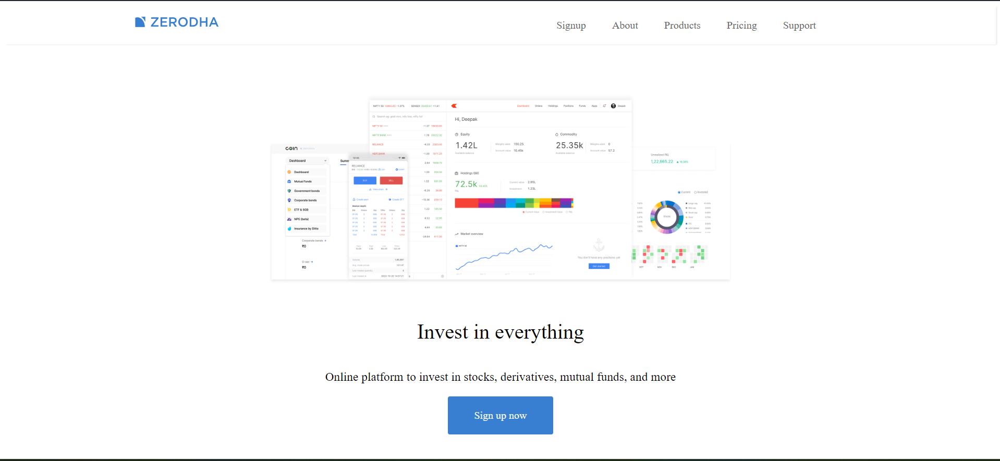

# Zerodha Landing Page
This project features a modern and responsive landing page inspired form Zerodha, created using HTML and CSS.

**Features:** 
1)Responsive Design:The landing page is fully responsive, ensuring a seamless experience across various devices and screen sizes. 
2)Modern Layout: A clean and professional design that reflects the aesthetic of Zerodha's branding. 
3)CSS Styling: Utilizes advanced CSS techniques for layout, animations, and transitions to enhance the user experience. 
4)Cross-Browser Compatibility: Tested to work flawlessly on major web browsers.

